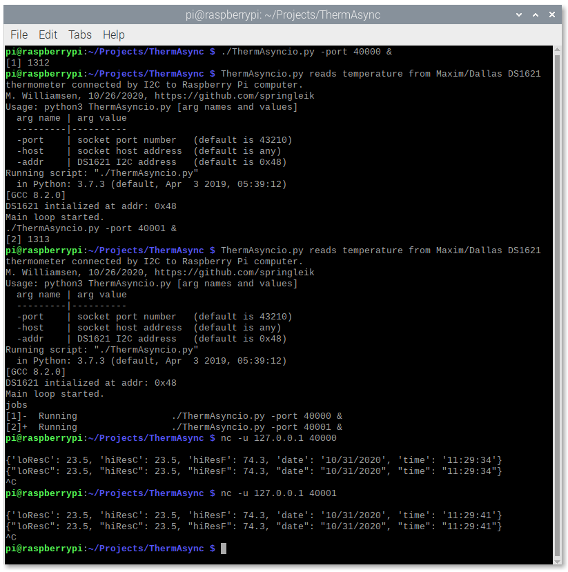

# ThermUDP
UDP Server for DS1621 Thermometer, running in Python 3 on a Raspberry Pi.  Typical UDP reply packet follows:
```JSON
{"loResC": 25.5, "hiResC": 25.375, "hiResF": 77.675, "date": "10/19/2020", "time": "17:09:58"}
```
The DS1621 is a self-contained thermometer and thermostat made by [Maxim](https://www.maximintegrated.com/en/products/sensors/DS1621.html) and available at [DigiKey](https://www.digikey.com/en/products/detail/maxim-integrated/DS1621/956905).  It interfaces with I<sup>2</sup>C, and its power supply range includes both 3.3V and 5.0V, so you can either connect it directly to the RasPi [GPIO header](https://www.raspberrypi.org/documentation/usage/gpio/) with 3.3V levels, or use a [level shifter](https://www.nxp.com/docs/en/application-note/AN10441.pdf) to operate at 5.0V.  In my application I used a level shifter implemented with an [FDC6301N](https://www.onsemi.com/products/discretes-drivers/mosfets/fdc6301n) dual FET, as suggested by [AB Electronics](https://www.abelectronics.co.uk/kb/article/1049/logic-level-converter).  You'll have to do some setup to get the RasPi talking with I<sup>2</sup>C, and details may vary depending on which RasPi you have.  I found the [SparkFun tutorial](https://learn.sparkfun.com/tutorials/raspberry-pi-spi-and-i2c-tutorial#i2c-on-pi) to be helpful.

The UDP temperature server posted here uses the [smbus](https://pypi.org/project/smbus2/) library to let Python 3 talk to the DS1621.  This library has the nice property that it allows multiple processes on the RasPi to interact with the I<sup>2</sup>C bus at the same time.  Obviously the accesses are serialized behind the scenes.  Interestingly, this works even if different processes try to access the same I<sup>2</sup>C address, which is to say the same chip.  So you can run two instances of the UPD server posted here at the same time, so long as they use different UDP port numbers.  Following is an unecessarily complicated example of how this can be done, using optional command line arguments to modify the server settings.  The [netcat](https://www.commandlinux.com/man-page/man1/nc.1.html) command line utility is used as the UDP client here:



There are various ways for the UDP server to start itself at boot time.  My favorite is [daemontools](https://cr.yp.to/daemontools.html).  Or you can just start it manually at the command line.  Once it's running, it listens for inbound UDP packets on the assigned port.  The content, if any, is ignored.  A one-shot conversion is initiated, and the result sent back to the client in engineering units.  This has the advantage that the DS1621 is idle between readings and can return to ambient temperature.  And the disadvantage that frequent readings, or readings from multiple clients, can increase duty cycle enough to increase measured temperature by some fraction of a degree.
